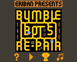
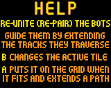
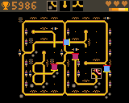
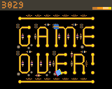

# Bumble Bots Re-Pair

Bumble Bots Re-Pair is an action game with puzzle elements.
This version is for the [Gamebuino][] console.
Although the game play is entirely different, it bears similarities in theming to my earlier [Bumble Bots] game.

Origin
------
The game is a spin-off of the Unity game [Robo Re-Pair][] which I and two others created during the 2020 [Global Game Jam][].
The theme of that jam was "repair" and we created a game where you need to re-unite pairs of
robots (re-pair) by fixing the grid that they traverse.

[Gamebuino]: https://gamebuino.com
[Bumble Bots]: https://gamebuino.com/creations/bumble-bots
[Robo Re-Pair]: https://globalgamejam.org/2020/games/robot-re-pair-3
[Global Game Jam]: https://globalgamejam.org